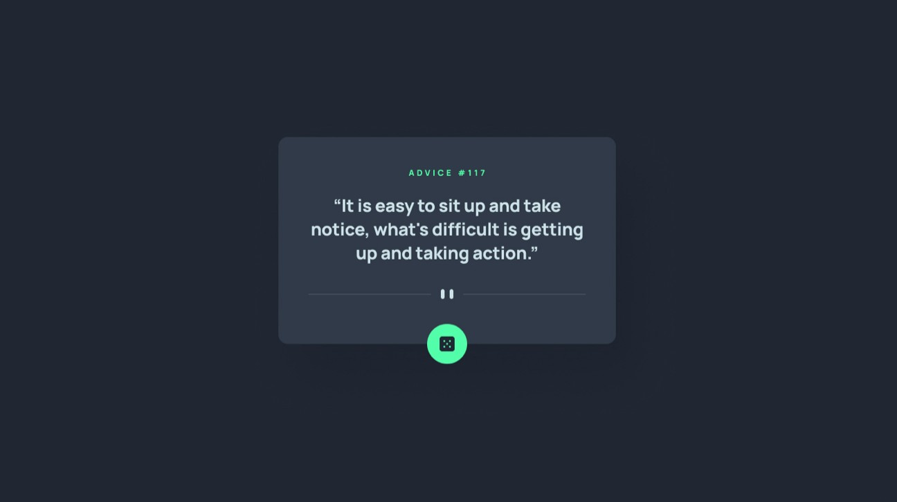

# DBA Consultants - Advice generator app

## Welcome! 👋

This assignment help you improve your coding skills by building realistic projects.

**To do this assignment, you need a basic understanding of HTML, CSS and JavaScript.**

## The challenge

Your assignment is to build out this Product preview card component and get it looking as close to the design as possible.

You can use any tools you like to help you complete the assignment. So if you've got something you'd like to practice, feel free to give it a go.

Your users should be able to:

- View the optimal layout for the app depending on their device's screen size
- See hover states for all interactive elements on the page
- Generate a new piece of advice by clicking the dice icon

## Where to find everything

Your task is to build out the project to the designs inside the `/design` folder. You will find both a mobile and a desktop version of the design.

The designs are in JPG static format. Using JPGs will mean that you'll need to use your best judgment for styles such as `font-size`, `padding` and `margin`.

All the required assets for this project are in the `/images` folder. The images are already exported for the correct screen size.

## Submitting your solution

Submit your solution on the google form which would be shared in some days.

Remember, if you're looking for any help on your solution, be sure to ask questions the mentors.

**Have fun building!** 🚀
